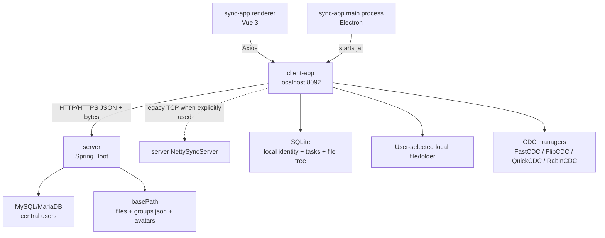

# DataSync Architecture

This document describes how the current repository is wired, which boundaries matter, and which invariants should be preserved when changing the system.

---

## High-Level System



There are three runtime processes in development:

1. `server`: central API and file storage service.
2. `client-app`: local API/agent that owns local filesystem and SQLite side effects.
3. `sync-app`: Electron desktop UI that starts `client-app` in packaged builds and calls it over localhost HTTP.

The renderer should not call the central server directly. It calls `client-app`, and `client-app` forwards or orchestrates central server requests.

---

## Runtime Ports

| Component         | Local default | Docker/Space default | Purpose                               |
| ----------------- | ------------: | -------------------: | ------------------------------------- |
| `server` HTTP     |        `8090` |               `7860` | Central API, health check, file bytes |
| `client-app` HTTP |        `8092` |                  n/a | Local desktop API                     |
| Legacy Netty      |        `8080` |               `8080` | Optional raw TCP upload path          |

The current desktop sync path is HTTP(S). Netty is retained for compatibility with self-hosted raw TCP deployments.

---

## Module Boundaries

### `sync-app`

`sync-app` is the desktop shell and UI.

Important files:

| Path                                       | Responsibility                                                                                             |
| ------------------------------------------ | ---------------------------------------------------------------------------------------------------------- |
| `src/main/index.js`                        | Creates the Electron window, starts/stops `client-app` jar, exposes file/folder pickers and open-file IPC. |
| `src/preload/index.js`                     | Exposes a restricted `window.electron` bridge.                                                             |
| `src/renderer/src/router.js`               | Routes, setup gate, login/session gate, cached session restoration.                                        |
| `src/renderer/src/utils/request.js`        | Axios instance for `http://127.0.0.1:8092`, response envelope handling, local token header injection.      |
| `src/renderer/src/views/HostConfig.vue`    | First-run remote server setup.                                                                             |
| `src/renderer/src/views/DashBoard.vue`     | Personal task list, group shared-space entry, dashboard search.                                            |
| `src/renderer/src/views/FileExplorer.vue`  | Local task file tree, upload/download/delete/open actions.                                                 |
| `src/renderer/src/views/GroupPage.vue`     | Group CRUD, member/admin management, shared scope management.                                              |
| `src/renderer/src/views/GroupExplorer.vue` | Browse and download group shared scopes.                                                                   |
| `src/renderer/src/views/LogPage.vue`       | Reads local backend logs.                                                                                  |

Rules:

- UI code calls `/client/**`, not `/server/**`.
- Electron IPC owns native file/folder dialogs and opening local files.
- `localStorage` is a convenience cache, not the source of truth for cross-device user fields.

### `client-app`

`client-app` is the local agent. It is the only layer that should mutate local files or local SQLite.

Important areas:

| Path                                   | Responsibility                                                                            |
| -------------------------------------- | ----------------------------------------------------------------------------------------- |
| `backend.controller.*`                 | UI-facing local endpoints under `/client/**`.                                             |
| `backend.service.impl.FileServiceImpl` | Task CRUD, local scanning, upload/download orchestration, remote restore, deletion guard. |
| `backend.service.impl.UserServiceImpl` | Login/signup/update proxying and local user cache.                                        |
| `backend.config.ClientConfigStore`     | Runtime server URL stored at `~/.datasync/client-config.json`.                            |
| `backend.util.HttpJsonClient`          | Central server HTTP client, JSON envelope parsing, raw byte download, raw byte upload.    |
| `backend.task.FileWatcherTask`         | Marks local tasks/subfiles as stale every 30 seconds.                                     |
| `backend.task.ScheduledSyncTask`       | Runs scheduled uploads every 60 seconds.                                                  |
| `backend.mapper.sqlite.*`              | SQLite mapper interfaces and XML.                                                         |
| `backend.sync.client.*`                | Legacy Netty client path.                                                                 |

Rules:

- `client-app` owns local filesystem side effects.
- SQLite writes must keep `User`, `File`, and `SubFile` relationships consistent.
- New server calls should go through `HttpJsonClient` so URL resolution and response envelope handling stay consistent.
- `ClientConfigStore.requireConfigured()` is the gate for central server calls.

### `server`

`server` is the central service.

Important areas:

| Path                                            | Responsibility                                                                           |
| ----------------------------------------------- | ---------------------------------------------------------------------------------------- |
| `backend.controller.UnAuthController`           | Login and signup under `/unauthorized/**`.                                               |
| `backend.controller.ServerSyncController`       | Compare, upload, download, delete scope, list scopes, migration endpoints.               |
| `backend.controller.GroupController`            | Group CRUD, roles, members, shared scopes, group file listing.                           |
| `backend.controller.UserController`             | User search, resolve, and profile update.                                                |
| `backend.controller.HealthController`           | `/` and `/health`.                                                                       |
| `backend.service.impl.FileServiceImpl`          | Server filesystem storage, path normalization, upload temp files, download list/content. |
| `backend.service.impl.GroupServiceImpl`         | `groups.json` management and group authorization checks.                                 |
| `backend.service.impl.UserServiceImpl`          | BCrypt password handling, JWT generation, avatar URL resolution.                         |
| `backend.mapper.mysql.UserMapper`               | Central user persistence.                                                                |
| `backend.sync.server.*`                         | Legacy Netty server path.                                                                |
| `backend.migration.ScopeStorageMigrationRunner` | Docker-profile legacy storage migration.                                                 |

Rules:

- Server storage must stay under `spring.netty.server.basePath`.
- File and scope path inputs must be normalized and path traversal must remain blocked.
- `groups.json` mutations must stay synchronized through `GroupServiceImpl`'s lock.
- Group member/admin mutations must validate target user existence.
- Avatar data stored in MySQL should remain a URL/string reference, not unbounded image bytes.

---

## Data Storage

### Server Filesystem

Configured by:

```yaml
application:
  netty:
    server:
      basePath: /sync
```

Layout:

```text
basePath/
|-- <email>/
|   `-- <taskAlias>/
|       `-- <rootName>/
|           `-- <relative files>
|-- avatars/
|   `-- <userId>.<ext>
`-- groups.json
```

Scope key:

```text
<email>/<taskAlias>/<rootName>
```

Examples:

```text
alice@example.com/Work/Documents
alice@example.com/Profile/avatar.png
```

The same scope key is used by:

- Server file storage.
- Group shared scope entries.
- Task deletion guard.
- Remote task discovery.
- Group explorer downloads.

### Server MySQL/MariaDB

The server database currently stores central user identity.

Table:

```sql
user(id, username, email, password, avatar, created_at, updated_at)
```

The `email` column is unique. Passwords are BCrypt hashes. `avatar` is a URL-like string or empty.

### Client SQLite

The client database stores local state:

- `User`: local cache of central user identity and token fields.
- `File`: sync task root metadata.
- `SubFile`: scanned file tree rows for task roots.

Important relationship:

```text
User.id -> File.user_id -> SubFile.file_id
```

The client must preserve the server `User.id` in SQLite. If local user rows have `id = null`, task creation and sync operations can fail because `File.user_id` cannot be resolved.

### `groups.json`

Example:

```json
[
  {
    "id": "group-uuid",
    "name": "Team Docs",
    "ownerEmail": "alice@example.com",
    "admins": ["bob@example.com"],
    "members": ["carol@example.com"],
    "scopes": ["alice@example.com/Work/Documents"]
  }
]
```

Role rules:

- Owner is unique and is stored in `ownerEmail`.
- Admins are stored in `admins`.
- Regular members are stored in `members`.
- Owner should not be duplicated into `admins` or `members`.

---

## Core Flows

### First-Run Setup

1. Electron starts the renderer.
2. Router calls `GET /client/config`.
3. `client-app` reads `~/.datasync/client-config.json`.
4. If no config exists, the router redirects to `/setup`.
5. The setup page posts config to `POST /client/config/test`.
6. `HttpJsonClient.testConnection()` sends `GET /` to the central server.
7. If reachable, the setup page saves config with `POST /client/config`.
8. Future central server requests resolve relative paths against `serverBaseUrl`.

### Login

1. Renderer calls `POST /client/user/login`.
2. `client-app` calls `POST /unauthorized/login` on the central server.
3. `server` validates email/password against MySQL.
4. `server` returns `{ id, username, email, token, avatar }`.
5. `client-app` upserts the local SQLite `User` by email.
6. Renderer stores `authToken` and `userInfo` in localStorage.

### Signup

1. Renderer calls `POST /client/user/signup`.
2. `client-app` calls `POST /unauthorized/signup`.
3. `server` creates the user or returns login data for an existing user with the same password.
4. `client-app` writes the local SQLite user cache.
5. Renderer proceeds with the cached session.

### Profile Update

1. Renderer sends the updated user object to `POST /client/user/update`.
2. `client-app` forwards to `POST /server/user/update`.
3. `server` preserves existing password and updates username/email/avatar.
4. If avatar is a supported data URL, `server` writes it under `basePath/avatars/`.
5. `server` returns public avatar URL fields.
6. `client-app` mirrors returned fields into SQLite.
7. Renderer updates localStorage.

### Task Create/Update

1. Renderer calls `POST /client/sync/update`.
2. `client-app` validates alias and path.
3. `client-app` checks duplicate alias for the same local user.
4. `File` row is inserted or updated.
5. If the path changed or the task is new, `addFiles()` runs after transaction commit.
6. `addFiles()` scans the selected file/folder and rebuilds `SubFile` rows.

### Upload Sync

1. Renderer calls `POST /client/sync/upload`.
2. `client-app` loads the `File` task by `fileId` or `path` and `email`.
3. `client-app` instantiates the selected CDC manager.
4. It recursively scans files and creates `SyncStyle` entries.
5. It builds:

```text
storageRoot = email/alias
scopeName = email/alias/rootName
storagePath = email/alias/<relative directory>
```

6. It calls `POST /server/file/compare` with the file list and scope metadata.
7. `server` creates the scope container, deletes stale remote files under the task container, and returns the list.
8. `client-app` uploads each existing local file with `POST /server/file/upload?storagePath=...&fileName=...`.
9. `server` writes bytes through `<fileName>.part`, then atomically replaces the final file where possible.
10. `client-app` marks `File.is_sync` and all related `SubFile.is_sync` rows as true.

### Download Sync

1. Renderer calls `POST /client/sync/download`.
2. `client-app` resolves the local task and builds `scopeName = email/alias/rootName`.
3. It calls `POST /server/file/download`.
4. `server` returns a list of relative file paths under the scope.
5. `client-app` calls `POST /server/file/download/file` for each relative path.
6. `client-app` writes bytes to local disk. Existing files are overwritten.
7. `client-app` rescans local files and marks task rows as synced.

### Remote Task Restore

1. Renderer calls `POST /client/file/remote-scopes`.
2. `client-app` forwards to `POST /server/file/list-scopes`.
3. `server` scans `basePath/<email>/`.
4. It returns `RemoteScope` entries: `{ alias, rootName, isDir, scopeName }`.
5. UI can create local tasks from those remote scopes, then download them.

### Group Sharing

1. Renderer calls `/client/group/**`.
2. `client-app` forwards to `/server/group/**`.
3. `server` reads and writes `groups.json` under a lock.
4. Mutating operations call role helpers:
   - `isOwner(group, email)` for owner-only operations.
   - `canManage(group, email)` for owner/admin operations.
5. Member/admin targets are validated against MySQL before being stored.
6. Group file browsing walks each scope under server `basePath`.

### Task Deletion Guard

1. Renderer calls `POST /client/sync/delete`.
2. `client-app` loads the task and builds its scope key.
3. It calls `POST /server/group/check-scope`.
4. If any group references the scope, deletion is refused.
5. If deletable, `client-app` calls `POST /server/file/delete-scope`.
6. `server` deletes the remote scope and cleans empty parents.
7. `client-app` deletes local `SubFile` and `File` rows.

---

## Background Jobs

### File Watcher

Class: `client-app/src/main/java/backend/task/FileWatcherTask.java`

Schedule:

```java
@Scheduled(fixedDelay = 30_000)
```

Behavior:

- Scans all local `File` rows.
- For directory tasks, detects root last-modified changes and inserts missing `SubFile` rows.
- For known subfiles, compares disk last-modified time against `File.update_time`.
- Marks changed entries as `is_sync = false`.
- Does not upload automatically.

### Scheduled Sync

Class: `client-app/src/main/java/backend/task/ScheduledSyncTask.java`

Schedule:

```java
@Scheduled(fixedDelay = 60_000)
```

Supported interval values:

| Value           | Meaning          |
| --------------- | ---------------- |
| `5m`            | Every 5 minutes  |
| `30m`           | Every 30 minutes |
| `1h`            | Every hour       |
| `6h`            | Every 6 hours    |
| `1d`            | Every day        |
| `15`            | Every 15 minutes |
| empty / `never` | disabled         |

The job only triggers upload sync.

---

## Security Model

Current implementation details:

- Server passwords use BCrypt strength 12.
- Server JWTs are generated from central user IDs.
- `JWTFilter` validates `Authorization: Bearer <token>` when a bearer token is present.
- Current `SecurityConfig` permits `/`, `/health`, `/resources/**`, `/unauthorized/**`, `/client/**`, and `/server/**`.
- This means endpoint-level business checks remain important. Public multi-tenant deployments should review and tighten HTTP authorization rules.
- Upload/download path traversal is blocked by canonical path checks.
- Unsafe upload file names are rejected.
- Avatar data URLs are validated by MIME type and size before writing to `basePath/avatars`.

---

## Build And Release Architecture

### CI

`.github/workflows/ci.yml` runs on pushes and pull requests to `main`:

- Server Spotless check and compile.
- Client-app Spotless check, compile, and SQLite schema test.
- Frontend dependency install, Prettier check, and ESLint.

### Release

`.github/workflows/release.yml` runs for pushed `v*` tags or manual dispatch:

1. Build `client-app` jar.
2. Create a bundled Java runtime with `jlink`.
3. Install `sync-app` dependencies.
4. Build Windows and Linux desktop packages.
5. Publish a GitHub Release with generated release notes and assets.

Current release tag: `v1.0.7`.

---

## Boundaries And Invariants

Preserve these unless deliberately changing the contract and updating all callers/docs:

- Renderer calls `client-app`; it should not bypass the local agent to mutate central server state.
- `client-app` owns local SQLite and local filesystem writes.
- `server` owns central storage, central users, group metadata, avatars, and remote file bytes.
- Scope keys must use `email/alias/rootName`.
- Remote file storage must stay under `basePath`.
- Group scopes must store full scope keys, not display-only names.
- `GroupServiceImpl` mutations must remain lock-protected.
- Owner/admin/member authorization helpers must be used for group mutations.
- Server-side member/admin adds must validate target users in MySQL.
- Task deletion must check group references before deleting local rows or remote storage.
- Single-file tasks and directory tasks must both remain supported.
- Download sync overwrites local files by design; this behavior must be explicit in UX/docs.
- MyBatis mapper interfaces and XML files must change together.
- `User.email` is the local unique identity key; local cache must preserve server `User.id`.
- Do not commit generated databases, logs, release artifacts, real secrets, private keys, or production config.

---

## Known Risks

- The Java modules duplicate CDC and backend package structures. Cross-module changes need paired review.
- Several source comments still originate from earlier Chinese comments and are not the authoritative documentation; rely on this file and API docs for current behavior.
- The current security configuration is permissive for `/server/**`; public deployments should harden it before exposing untrusted traffic.
- Download operations can overwrite local user data.
- Space deployments without persistent storage lose `/sync` contents after rebuild/restart.
- `groups.json` is a simple file store. It is adequate for small deployments, but large multi-user deployments should move group metadata to a database.
- Current release packaging includes Windows and Linux artifacts. macOS packaging exists in `electron-builder.yml` but is not part of the release workflow matrix.

---

## Where To Look For Changes

| Change type                   | Files to inspect first                                                                                         |
| ----------------------------- | -------------------------------------------------------------------------------------------------------------- |
| Sync upload/download behavior | `client-app/.../FileServiceImpl.java`, `server/.../FileServiceImpl.java`, `ServerSyncController.java`          |
| Task CRUD and file tree       | `client-app/.../FileServiceImpl.java`, `FileMapper.*`, `SubFileMapper.*`, SQLite schema                        |
| Group behavior                | `server/.../GroupServiceImpl.java`, `GroupController.java`, group models, `GroupPage.vue`, `GroupExplorer.vue` |
| User/profile/avatar           | `server/.../UserServiceImpl.java`, `client-app/.../UserServiceImpl.java`, `UserMapper.*`, profile UI           |
| Desktop startup/packaging     | `sync-app/src/main/index.js`, `sync-app/electron-builder.yml`, `.github/workflows/release.yml`                 |
| Server deployment             | `server/Dockerfile`, `server/docker-entrypoint.sh`, `server/src/main/resources/application-docker.yml`         |
| Runtime setup                 | `ClientConfigStore.java`, `HostConfig.vue`, `HttpJsonClient.java`                                              |
