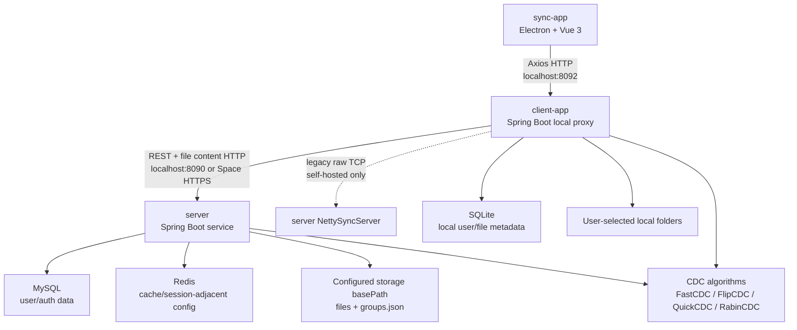

# DataSync Architecture

This document captures the current system map and the boundaries agents should preserve while changing the repository.

## System Map

## Modules

`sync-app/` is the desktop shell and renderer.

- `src/main/index.js`: Electron main process.
- `src/preload/index.js`: preload bridge.
- `src/renderer/src/router.js`: renderer routes.
- `src/renderer/src/views/`: Dashboard, FileExplorer, GroupPage, GroupExplorer, auth pages, LogPage.
- `src/renderer/src/utils/request.js`: Axios wrapper — interceptor does `response.data`, so callers receive the `ResultEntity` body; actual payload is at `res?.data`.

`client-app/` is the local Spring Boot proxy on port `8092`.

- `backend.controller.GroupController`: proxies all `/client/group/*` → `server/group/*`, including batch member ops (`add-members`, `remove-members`) and admin ops (`add-admin`, `remove-admin`).
- `backend.controller.UserController`: proxies `/client/user/search` → `server/user/search`.
- `backend.controller.UserController` and `backend.service.UserService`: local login/signup/profile cache; profile changes that should be visible to other users must also flow to `server/` before the local SQLite cache is treated as updated.
- `backend.controller.*`: other UI-facing REST endpoints for files, sync tasks, logs.
- `backend.service.*`: local task/file/user workflows.
- `backend.mapper.sqlite.*` and XML mappers: SQLite persistence.
- `backend.sync.*`: legacy Netty client transport for self-hosted deployments; the packaged client uploads file content through HTTP.
- `dataSync/*`: CDC implementations used for chunking.

`server/` is the central Spring Boot service on port `8090`.

- `backend.controller.UnAuthController`: login, registration, token refresh.
- `backend.controller.ServerSyncController`: compare/download endpoints used by the client proxy.
- `backend.controller.GroupController`: group management — create, delete, add/remove member, add/remove members (batch), add/remove admin, list, files.
- `backend.controller.UserController`: authenticated user search (`POST /server/user/search`).
- `backend.controller.UserController` and `backend.service.UserService`: central user profile data used by login, fuzzy user search, and group-member autocomplete. Avatar values returned here must be remotely loadable by other desktop clients.
- `backend.service.*`: user, file, and group workflows.
- `backend.mapper.mysql.UserMapper`: MySQL user persistence; includes `searchByQuery` for fuzzy member search.
- `backend.sync.server.*`: legacy Netty server and sync packet handling.
- `dataSync/*`: matching CDC implementations used when comparing/reconstructing content.

## Runtime Configuration

- README documents HTTP defaults `server:8090` and `client-app:8092`; the Docker Space profile uses HTTP port `7860`.
- Netty defaults to port `8080`, but Hugging Face Spaces does not expose raw TCP Netty traffic. Space deployments must use the HTTP upload/download endpoints through HTTPS.
- Docker Space storage uses `NETTY_BASE_PATH=/sync`. When persistent storage is attached, `docker-entrypoint.sh` links `/sync` to `/data/sync` so uploaded files survive restarts.
- `server/src/main/resources/application*.yml` contains MySQL, Redis, AWS S3, JWT, Netty, and logging settings.
- `client-app/src/main/resources/application*.yml` contains SQLite, JWT, Netty, and logging settings.
- Environment-specific values and credentials should move to environment variables or ignored local override files.

## Core Flows

Upload sync:

1. `sync-app` calls `POST /client/sync/upload`.
2. `client-app` loads the local sync task, chunks files with the selected CDC algorithm.
3. Each `SyncStyle.storagePath` is prefixed with `email/` so files are stored under `basePath/email/folderName/...`. This namespacing prevents two users with identically named folders from overwriting each other's data.
4. `client-app` sends the file list (with email) to `POST /server/file/compare`; `server` uses `email/folderName` as the scope directory.
5. `client-app` uploads changed files to `POST /server/file/upload` using `application/octet-stream`; `server` writes files to the email-namespaced path via `.part` temp files.
6. `client-app` marks local SQLite `File` and `SubFile` records as synced only after the HTTP upload phase succeeds.

Download sync:

1. `sync-app` calls `POST /client/sync/download` or group scope download endpoints.
2. `client-app` constructs `scopeName = email + "/" + folderName` and asks `server` for that scope.
3. `server` enumerates `basePath/email/folderName/` and returns file relative-path list.
4. `client-app` downloads each file and writes it to the local path, then updates SQLite state.

Group sharing:

1. `sync-app` group views call `client-app` group endpoints.
2. `client-app` forwards group operations to `server`.
3. `server` checks role authorization before mutating `groups.json`:
   - **Owner**: full control (delete group, add/remove admins, manage members and scopes).
   - **Admin**: can add/remove regular members and manage scopes; cannot manage other admins.
   - **Member**: read-only (sees the group; cannot mutate).
   - Owner is always unique and is not listed in the `admins` array — authorization logic checks owner separately.
4. `groups.json` Group schema: `{ id, name, ownerEmail, admins: [], members: [], scopes: [] }` where each scope value is `ownerEmail/folderName` (e.g. `alice@example.com/Documents`).
5. Scope display: `sync-app` strips the `ownerEmail/` prefix before showing scope names in `GroupPage`, `Dashboard`, and `GroupExplorer` breadcrumbs. The full `email/folderName` key is always sent to the API.
6. Member add supports fuzzy search (`/server/user/search` queries MySQL `LIKE` on email/username) and batch file import (client-side `.txt`/`.csv` parsing → `/client/group/add-members`).
7. Single-member add in the UI should be selected-user-first: search returns concrete user cards, the chosen card supplies the member email, and free-text values must not be submitted as if they were valid users.
8. Server-side group member mutations still own correctness. Direct calls and batch imports must validate target users against the central user store before writing strings into `groups.json`.
9. Group file browsing is built from server-side scope traversal over `basePath/email/folderName/`.

Task deletion guard:

1. Before deleting a sync task, `client-app` calls `POST /server/group/check-scope` with `scopeName = email/folderName`.
2. If any group contains that scope, the server returns `false`.
3. `client-app` throws `BaseException(409)` with a human-readable message; `sync-app` displays the error in the delete-confirmation dialog.
4. The user must delete the group or remove the scope from the group before the task can be deleted.

Profile and avatar settings:

1. `sync-app` opens `ProfileModal` with the current local `userInfo` snapshot.
2. `sync-app` must call `client-app` for profile updates; it must not call `/server/**` directly.
3. `client-app` updates the central server profile first, then mirrors the returned user fields into local SQLite and `sync-app` localStorage.
4. Server-side user data is the source of truth for fields other users can see, including avatars shown in group-member search results.
5. Local avatar image upload should resolve to a remotely loadable avatar URL before persistence. Avoid storing large image blobs in MySQL when a static/object URL can be stored instead.
6. The local SQLite `User` cache must keep the server `id` and enforce unique `email`. Sync tasks store `File.user_id`, so a cached user row with `id = null` breaks task creation, listing, upload, download, and deletion.

Dashboard search:

1. The dashboard top search box is a single visible query for the landing page.
2. Personal task filtering is client-side over brief task fields returned by `/client/file/brief-list`.
3. Group shared-file filtering is client-side over `/client/group/files` payloads unless a new server-side search contract is deliberately added.
4. Empty query restores both personal task results and group shared-space results; the two lists should not share mutable filtered state.

## Boundaries And Invariants

- The desktop renderer should call `client-app`, not mutate server storage or SQLite directly.
- `client-app` owns local filesystem and SQLite side effects; tests must use temp directories and disposable SQLite files.
- `server` owns central storage, MySQL integration, group metadata, HTTP file storage, and legacy Netty receive/reconstruction behavior.
- Upload/download paths are data-loss-sensitive. Preserve path normalization, scope derivation, and overwrite/delete semantics deliberately.
- **Scope namespacing** — server storage paths must always use the format `basePath/email/folderName/`. Never write to `basePath/folderName/` directly; that was the pre-fix format and causes multi-user collisions. The `email` used is the task owner's login email, taken from the authenticated session — not a user-supplied string.
- **Scope key format** — `Group.scopes` entries and all API `scopeName` parameters must be `email/folderName` strings. Never store bare folder names; doing so breaks both storage routing and the deletion guard.
- **Task deletion guard** — `client-app.FileServiceImpl.deleteFileTask()` must call `POST /server/group/check-scope` before removing local SQLite records. Bypassing this check can leave group members with a dangling scope that points to deleted server storage.
- Keep legacy Netty encryption compatible: AES-256-GCM per packet and RSA-OAEP key exchange must remain symmetric between client and server.
- REST contracts documented in `API.md` should remain backward compatible unless the change updates callers and docs together.
- MyBatis Java mapper interfaces and XML mapper files must change together.
- Never introduce new hard-coded credentials, private keys, tokens, or production hosts.
- Profile/account changes that affect remote-visible user fields must keep `sync-app`, `client-app`, `server`, and mapper XML in lockstep. LocalStorage and SQLite are caches, not the cross-device source of truth.
- **Local user identity cache** — `client-app` must treat `User.email` as the local unique key and preserve the server `User.id` in SQLite. Login/signup writes should upsert by email instead of creating duplicate local users.
- User avatar values stored in MySQL should be small URL-like strings, not unbounded raw image payloads. If local image upload is supported, validate type/size and store the file under a controlled server-side location or external object store.
- **Group authorization** — any server-side operation that mutates a Group must call `canManage(group, email)` (owner or admin) or `isOwner(group, email)` (owner-only). Never bypass the helpers; do not read `ownerEmail` / `admins` inline for authorization decisions.
- **groups.json consistency** — `GroupServiceImpl` exposes `readGroups()` and `writeGroups()` as separate `synchronized` methods. Any new mutation must call both within the same logical operation and never let another thread interleave a read between two writes.
- **Group member integrity** — server-side add-member/add-members/admin-promotion paths must validate the target email exists in the central user store before adding it to `members` or `admins`. UI autocomplete helps user experience, but it is not the integrity boundary.

## Generated And Local-Only Paths

Do not edit or treat these as source of truth unless explicitly asked:

- `.git/`, `.idea/`, `.claude/`
- `.tmp-pdf/`, `tmp/`, `output/`, `毕业设计论文/output/`
- `node_modules/`, `sync-app/build/`, `sync-app/out/`
- `server/target/`, `client-app/target/`
- `server/log/`, `client-app/log/`
- local SQLite database files such as `datasync-user.db`
- generated thesis/PDF artifacts

## Risks And Open Questions

- Baseline config contains hard-coded secret-like values and live remote endpoints. Do not copy or expand them; see `docs/exec-plans/tech-debt-tracker.md`.
- Java tests are currently minimal Spring context tests and may depend on live development configuration.
- The Java modules duplicate substantial package structure. Cross-module changes need paired review to avoid protocol drift.
- `client-app` local user schema/mappers have drift risk around profile fields; profile work should verify a fresh SQLite schema, old SQLite migration behavior, and existing local DB behavior.
- `HttpJsonClient` handles JSON requests plus octet-stream file upload/download; timeout and error behavior are part of the sync contract.
- File sync operations can overwrite or delete user data. Prefer fixtures and temp folders for verification.
- Hugging Face Space deployments need persistent storage enabled for `/data/sync`; otherwise files written to `/sync` are lost when the Space restarts.
