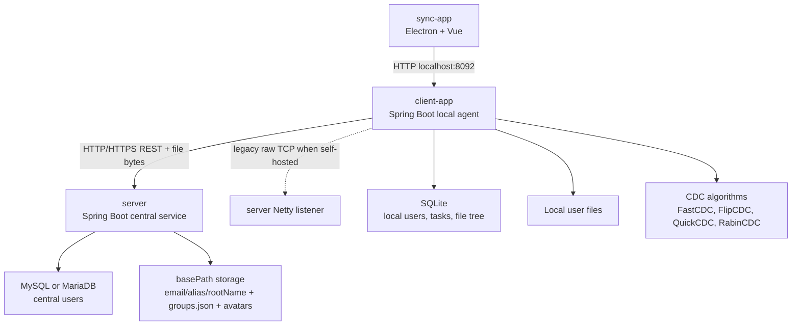

# DataSync

**English | [中文](README.zh.md)**

[](LICENSE)
[](https://www.oracle.com/java/)
[](https://spring.io/projects/spring-boot)
[](https://vuejs.org/)
[](https://www.electronjs.org/)

DataSync is a desktop file synchronization and backup system. It combines a Spring Boot server, a local Spring Boot client agent, and an Electron/Vue desktop UI. The client scans local files, chunks content with CDC algorithms, uploads only the current task scope through HTTP(S), and can restore personal or group-shared files from a remote server.

The current release line is **v1.0.7**.

---

## Screenshots

| Dashboard                                    | File Explorer                                             |
| -------------------------------------------- | --------------------------------------------------------- |
|  |  |

| Group Management                                           | Group File Browser                                     |
| ---------------------------------------------------------- | ------------------------------------------------------ |
|  |  |

| Log Page                                   | Sync Algorithm Selection                               |
| ------------------------------------------ | ------------------------------------------------------ |
|  |  |

<details>
<summary>More screenshots</summary>

| Login                                | Register                                   |
| ------------------------------------ | ------------------------------------------ |
|  |  |

| File List View                                        | Account Settings                                           |
| ----------------------------------------------------- | ---------------------------------------------------------- |
|  |  |

</details>

---

## Contents

- [What DataSync Does](#what-datasync-does)
- [Repository Layout](#repository-layout)
- [Runtime Architecture](#runtime-architecture)
- [Feature Overview](#feature-overview)
- [Quick Start](#quick-start)
- [Configuration](#configuration)
- [Desktop Usage](#desktop-usage)
- [Build And Verification](#build-and-verification)
- [Deployment](#deployment)
- [Release Process](#release-process)
- [Documentation Index](#documentation-index)
- [Security Notes](#security-notes)
- [Troubleshooting](#troubleshooting)
- [Contributing](#contributing)
- [License](#license)

---

## What DataSync Does

DataSync is designed for users who need a private file sync target with a desktop client and group sharing:

- Keep local folders or individual files backed up on a remote server.
- Upload changed task content through HTTP(S), including deployments behind HTTPS-only platforms such as Hugging Face Spaces.
- Restore remote task scopes to a new or reinstalled desktop client.
- Share uploaded task scopes with groups and let group members browse or download shared content.
- Track local file tree state in SQLite and mark changed files as pending sync.
- Use a desktop UI rather than manual command-line sync commands.

DataSync is not a conflict-free collaborative editor. Download operations overwrite local files under the selected task or target directory. Treat shared folders and remote restores as synchronization/backups, not real-time collaborative editing.

---

## Repository Layout

```text
datasync/
|-- server/                         Central Spring Boot service
|   |-- src/main/java/backend/
|   |   |-- controller/              REST controllers for auth, files, groups, users, health
|   |   |-- service/                 Server-side file storage, group, user logic
|   |   |-- mapper/mysql/            MyBatis mapper for central users
|   |   |-- sync/server/             Legacy Netty receive path
|   |   `-- migration/               Legacy storage migration support
|   |-- src/main/java/dataSync/      CDC algorithm implementations
|   |-- src/main/resources/          Profiles, MyBatis XML, SQL schema
|   |-- Dockerfile                   Hugging Face Space / Docker server image
|   `-- README.md                    Server deployment notes
|
|-- client-app/                      Local Spring Boot agent started by Electron
|   |-- src/main/java/backend/
|   |   |-- controller/              UI-facing local REST API
|   |   |-- service/                 Local SQLite, file scanning, upload/download orchestration
|   |   |-- mapper/sqlite/           SQLite mapper interfaces and XML
|   |   |-- task/                    File watcher and scheduled sync jobs
|   |   |-- config/                  Client server configuration store
|   |   `-- sync/client/             Legacy Netty send path
|   |-- src/main/java/dataSync/      Same CDC algorithm implementations
|   `-- src/main/resources/          SQLite schema and development config
|
|-- sync-app/                        Electron + Vue desktop application
|   |-- src/main/                    Electron main process; starts client-app jar
|   |-- src/preload/                 IPC bridge
|   |-- src/renderer/src/
|   |   |-- views/                   Login, setup, dashboard, files, groups, logs
|   |   |-- components/              Reusable Vue components
|   |   `-- utils/request.js         Axios wrapper for local client API
|   `-- electron-builder.yml         Desktop packaging config
|
|-- docs/screenshots/                UI screenshots used by README
|-- docs/RELEASE.md                  Release checklist and versioning notes
|-- API.en.md / API.md               REST API reference
|-- Database Tables.en.md / .md      Database and JSON storage reference
|-- ARCHITECTURE.md                  Detailed architecture and invariants
`-- .github/workflows/              CI and release workflows
```

---

## Runtime Architecture



Default ports:

| Component    |                                   Default port | Purpose                                                |
| ------------ | ---------------------------------------------: | ------------------------------------------------------ |
| `server`     | `8090` locally, `7860` in Docker Space profile | Central API, file upload/download, health check        |
| `client-app` |                                         `8092` | Local API used by the Electron renderer                |
| Legacy Netty |                                         `8080` | Optional raw TCP sync path for self-hosted deployments |

DataSync's packaged upload path is HTTP(S)-first. The Netty classes remain in the codebase for self-hosted raw TCP environments, but the current desktop packaging uses `POST /server/file/upload` and `POST /server/file/download/file` for file bytes.

Remote storage keys use this format:

```text
basePath/<ownerEmail>/<taskAlias>/<rootName>/<relative file path>
```

Examples:

```text
/sync/alice@example.com/Work/Documents/report.docx
/sync/alice@example.com/Profile/avatar.png
```

This `email/alias/rootName` scope layout avoids collisions when one user creates multiple tasks with the same root folder name or when different users sync folders with identical names.

---

## Feature Overview

### Desktop Client

- First-run setup screen for the remote server URL and legacy sync host/port.
- Login, registration, cached local session restore, and profile/avatar editing.
- Dashboard with personal sync tasks and shared group scopes.
- Task creation for directories or individual files.
- Task alias, description, local path, remote host, schedule interval, and CDC algorithm selection.
- File explorer with folder navigation, list/grid mode, sync state, upload, download, delete, and open-file actions.
- Log page that reads the local client backend log.

### Synchronization

- Upload scans the selected local root and builds a file list with one of four CDC implementations: FastCDC, FlipCDC, QuickCDC, RabinCDC.
- Server-side compare cleans stale remote files inside the task container and returns the files that need upload.
- File bytes are uploaded over HTTP(S) as `application/octet-stream`.
- Server writes upload bytes through `.part` temp files before replacing the target file.
- Download lists remote files first, then downloads each file's raw bytes and overwrites the local target.
- Single-file tasks and directory tasks are both supported.
- Remote task discovery lists server scopes for users reinstalling the client with an empty local SQLite database.

### Local State

- `client-app` stores local users, sync tasks, and scanned file tree rows in SQLite.
- A file watcher runs every 30 seconds and marks changed local tasks or subfiles as not synced.
- A scheduled sync job runs every minute and triggers upload when a task's interval is due.
- Supported schedule strings are `5m`, `30m`, `1h`, `6h`, `1d`, or a plain number interpreted as minutes. Empty values and `never` disable scheduled sync.

### Group Sharing

- Group metadata is stored by the server in `groups.json` under the configured storage base path.
- Roles:
  - Owner: full control, including deleting the group and promoting/removing admins.
  - Admin: can manage regular members and shared scopes.
  - Member: can view groups and download shared scopes.
- Members are added by email. Server-side mutations validate that target users exist in MySQL.
- Batch member import supports multiple emails through the `add-members` and `remove-members` endpoints.
- Shared scopes use the same `ownerEmail/alias/rootName` key used by sync storage.
- Task deletion is blocked while a group still references that scope.

---

## Quick Start

### Prerequisites

| Tool             | Version                           | Required for                           |
| ---------------- | --------------------------------- | -------------------------------------- |
| Java JDK         | 21+                               | `server`, `client-app`, release builds |
| Maven            | 3.8+ or bundled wrappers          | Java build and tests                   |
| Node.js          | 20 recommended, 18+ usually works | `sync-app` development                 |
| npm              | From Node.js install              | Frontend dependencies                  |
| MySQL or MariaDB | 8.0+ compatible                   | Central server user database           |
| OpenSSL          | Any recent version                | Generating JWT/RSA secrets when needed |

Redis settings exist in the configuration files, but the currently documented runtime path does not require a packaged Redis instance.

### 1. Clone

```bash
git clone https://github.com/Alexander-Bruce/datasync.git
cd datasync
git config core.hooksPath .githooks
```

### 2. Prepare MySQL

Create the database:

```sql
CREATE DATABASE datasync CHARACTER SET utf8mb4 COLLATE utf8mb4_unicode_ci;
```

Initialize the user table:

```bash
mysql -u root -p datasync < server/src/main/resources/db/mysql-init.sql
```

### 3. Configure The Server

Edit `server/src/main/resources/application-dev.yml` for local development. Replace placeholder values such as `xxxxxx` with local credentials.

Important fields:

```yaml
application:
  datasource:
    mysql:
      url: jdbc:mysql://localhost:3306/datasync
      username: root
      password: xxxxxx
  netty:
    server:
      port: 8080
      basePath: /path/to/server/storage
  jwt:
    secretkey: xxxxxx
```

Generate a JWT secret:

```bash
openssl rand -base64 32
```

Start the server:

```bash
cd server
./mvnw spring-boot:run
```

On Windows PowerShell:

```powershell
cd server
.\mvnw.cmd spring-boot:run
```

Verify:

```bash
curl http://localhost:8090/health
```

Expected response:

```json
{ "status": "ok", "service": "datasync-server" }
```

### 4. Configure And Start The Local Client Agent

Edit `client-app/src/main/resources/application-dev.yml`.

For local server testing, keep:

```yaml
application:
  datasource:
    sqlite:
      url: jdbc:sqlite:datasync-user.db?journal_mode=WAL&busy_timeout=5000
  netty:
    client:
      host: localhost
      port: 8080
```

The actual HTTP server URL is stored at runtime by the setup screen in:

```text
~/.datasync/client-config.json
```

Start the local client agent:

```bash
cd client-app
./mvnw spring-boot:run
```

On Windows PowerShell:

```powershell
cd client-app
.\mvnw.cmd spring-boot:run
```

### 5. Start The Desktop UI

In a third terminal:

```bash
cd sync-app
npm install
npm run dev
```

The Electron window opens. On the first run, configure the remote server URL:

```text
http://localhost:8090
```

Then register or log in.

---

## Configuration

### Server Local Profile

`server/src/main/resources/application.yml` sets the server port and activates the `dev` profile. Local values come from `server/src/main/resources/application-dev.yml`.

Most important settings:

| Setting                             | Meaning                                                                        |
| ----------------------------------- | ------------------------------------------------------------------------------ |
| `server.port`                       | HTTP API port. Default local value is `8090`.                                  |
| `application.datasource.mysql.*`    | Central user database connection.                                              |
| `application.netty.server.basePath` | Root directory for synced files, `groups.json`, and avatars.                   |
| `application.netty.server.port`     | Legacy Netty listener port.                                                    |
| `application.jwt.secretkey`         | Base64 JWT signing secret. Use a private value in real deployments.            |
| `application.aws.s3.*`              | Reserved S3-compatible settings; not required for the default filesystem path. |

### Client Local Profile

`client-app` uses `client-app/src/main/resources/application-dev.yml` and a runtime config file.

| Setting                                  | Meaning                                                                 |
| ---------------------------------------- | ----------------------------------------------------------------------- |
| `application.datasource.sqlite.url`      | Local SQLite database path.                                             |
| `application.netty.client.host` / `port` | Legacy Netty fallback values.                                           |
| `application.jwt.secretkey`              | Must match the server if JWT validation is enabled across modules.      |
| `~/.datasync/client-config.json`         | Runtime server URL, sync host, and sync port saved by the setup screen. |

### Runtime Client Config JSON

Example:

```json
{
  "serverBaseUrl": "https://example-datasync-server.com",
  "syncHost": "example-datasync-server.com",
  "syncPort": 8080,
  "configured": true
}
```

For Hugging Face Spaces:

```json
{
  "serverBaseUrl": "https://<space-name>.hf.space",
  "syncHost": "<space-name>.hf.space",
  "syncPort": 8080,
  "configured": true
}
```

The packaged HTTP upload/download path uses `serverBaseUrl`. `syncHost` and `syncPort` remain for legacy Netty compatibility.

---

## Desktop Usage

1. Open the desktop application.
2. If the setup page appears, enter the server URL and test the connection.
3. Register a user or log in.
4. Create a sync task from the dashboard.
5. Choose a folder or file, enter an alias, pick a CDC algorithm, and optionally choose a schedule interval.
6. Open the task to browse its local file tree.
7. Use upload sync to back up the local task to the server.
8. Use download sync to restore from the server to the local path. Existing local files can be overwritten.
9. Create groups from the group page when files need to be shared.
10. Add members by email, add shared scopes, and let members browse/download shared files from the group explorer.

Recommended CDC selection:

| Algorithm | Suggested use                                           |
| --------- | ------------------------------------------------------- |
| FastCDC   | General default for large or frequently changing files. |
| QuickCDC  | Faster scanning where precision is less important.      |
| RabinCDC  | Traditional rolling-hash CDC behavior.                  |
| FlipCDC   | Alternative CDC implementation retained by the project. |

---

## Build And Verification

### Java Format And Compile

```bash
cd server
./mvnw spotless:check --no-transfer-progress
./mvnw compile -DskipTests --no-transfer-progress
```

```bash
cd client-app
./mvnw spotless:check --no-transfer-progress
./mvnw compile -DskipTests --no-transfer-progress
./mvnw test -Dtest=SqliteSchemaInitializerTest --no-transfer-progress
```

### Frontend Format And Lint

```bash
cd sync-app
npm ci
npx prettier --check "src/**/*.{js,vue,css,html}"
npm run lint
```

### Desktop Packaging

The Electron package expects the local client backend jar at:

```text
client-app/target/dataSync-server-0.0.1-SNAPSHOT.jar
```

Build it first:

```bash
cd client-app
./mvnw -DskipTests package --no-transfer-progress
```

Then package the desktop app:

```bash
cd sync-app
npm run build:win
npm run build:linux
npm run build:mac
```

CI builds Windows and Linux release artifacts through `.github/workflows/release.yml`.

---

## Deployment

### Local Server

Use the local server profile when running on your own machine:

```bash
cd server
./mvnw spring-boot:run
```

Keep `application-dev.yml` free of real committed secrets. If you must edit tracked configuration files locally, review `git diff` before committing.

### Docker / Hugging Face Space

The `server/` directory is a Docker SDK Hugging Face Space app. It runs:

- Spring Boot server on port `7860`.
- Embedded MariaDB inside the container.
- File storage under `/sync`.
- Persistent storage symlink from `/sync` to `/data/sync` when Space persistent storage is enabled.

Required secrets for real deployment:

| Secret             | Purpose                                                 |
| ------------------ | ------------------------------------------------------- |
| `MYSQL_PASSWORD`   | MariaDB root password used by the container entrypoint. |
| `JWT_SECRETKEY`    | JWT signing secret.                                     |
| `AWS_S3_ACCESSKEY` | Optional S3-compatible access key placeholder.          |
| `AWS_S3_SECRETKEY` | Optional S3-compatible secret key placeholder.          |

Useful optional variables:

| Variable            | Default                                    |
| ------------------- | ------------------------------------------ |
| `MYSQL_URL`         | `jdbc:mysql://127.0.0.1:3306/datasync`     |
| `MYSQL_USERNAME`    | `root`                                     |
| `NETTY_BASE_PATH`   | `/sync`                                    |
| `NETTY_SERVER_PORT` | `8080`                                     |
| `PUBLIC_BASE_URL`   | Empty; inferred from request when possible |

See [server/README.md](server/README.md) for more deployment details.

---

## Release Process

Current public release: **DataSync v1.0.7**.

Release assets are produced by `.github/workflows/release.yml` when a `v*` tag is pushed or when the workflow is manually dispatched.

Typical release flow:

```bash
git checkout main
git pull --ff-only
git tag v1.0.8
git push origin v1.0.8
```

The workflow builds:

- Windows installer: `sync-app-<version>-setup.exe`
- Windows blockmap: `sync-app-<version>-setup.exe.blockmap`
- Linux AppImage: `sync-app-<version>.AppImage`
- Linux Debian package: `sync-app_<version>_amd64.deb`
- Electron updater metadata: `latest.yml`, `latest-linux.yml`

More detailed release notes are in [docs/RELEASE.md](docs/RELEASE.md).

---

## Documentation Index

| Document                                         | Purpose                                                                       |
| ------------------------------------------------ | ----------------------------------------------------------------------------- |
| [README.zh.md](README.zh.md)                     | Chinese project overview and operation guide.                                 |
| [ARCHITECTURE.md](ARCHITECTURE.md)               | Module boundaries, runtime flows, storage layout, invariants, and risk notes. |
| [API.en.md](API.en.md)                           | English REST API reference.                                                   |
| [API.md](API.md)                                 | Chinese REST API reference.                                                   |
| [Database Tables.en.md](Database%20Tables.en.md) | English database and JSON storage reference.                                  |
| [Database Tables.md](Database%20Tables.md)       | Chinese database and JSON storage reference.                                  |
| [server/README.md](server/README.md)             | Server Docker and Hugging Face Space deployment guide.                        |
| [docs/RELEASE.md](docs/RELEASE.md)               | Release checklist, artifact names, and rollback notes.                        |

---

## Security Notes

- Passwords are stored with BCrypt strength 12 on the central server.
- JWTs are generated by the server and cached by the local client.
- The current Spring Security configuration permits `/client/**` and `/server/**` routes, while the JWT filter validates a bearer token if one is present. Treat this as a desktop/private deployment model unless access rules are tightened for public multi-tenant hosting.
- Avatar uploads accept base64 data URLs for selected image types and reject files larger than 2 MB.
- Server file paths are normalized and checked to stay inside the configured storage base path.
- Uploads reject unsafe file names and use `.part` temporary files.
- Do not commit real database passwords, JWT secrets, private keys, local SQLite databases, generated logs, or packaged release artifacts.

---

## Troubleshooting

### The desktop app stays on setup

Make sure the local client agent is running on `127.0.0.1:8092`. In development, start `client-app` before `sync-app`. In packaged builds, Electron starts the client backend jar automatically.

### Setup test cannot reach the server

Check that the server health endpoint responds:

```bash
curl http://localhost:8090/health
```

If the server is hosted on Hugging Face Spaces, use the HTTPS Space URL, not the raw Netty host.

### Login fails after reinstalling the client

The local SQLite cache may be empty while Electron still has old localStorage. Clear app storage or log in again. The `/client/user/session/current` and `/server/user/resolve` paths are used to restore sessions when enough local cache exists.

### Upload succeeds but files disappear after a Space restart

Enable Hugging Face persistent storage. Without it, `/sync` is ephemeral. With persistent storage, the entrypoint links `/sync` to `/data/sync`.

### A task cannot be deleted

The task scope is still referenced by a group. Remove the shared scope from the group or delete the group first, then delete the task.

### Downloads overwrite local files

This is expected. DataSync's download flow restores the remote scope to the selected local target and overwrites same-path files.

---

## Contributing

1. Fork the repository.
2. Enable hooks after cloning: `git config core.hooksPath .githooks`.
3. Keep Java formatted with Spotless and frontend code formatted with Prettier.
4. Run the relevant checks before pushing.
5. Do not commit local credentials or generated runtime files.
6. Open a pull request against `main`.

---

## License

DataSync is licensed under the [MIT License](LICENSE).
