# DataSync

**[English](README.md) | 中文**

[](LICENSE)
[](https://www.oracle.com/java/)
[](https://spring.io/projects/spring-boot)
[](https://vuejs.org/)
[](https://www.electronjs.org/)

DataSync 是一个桌面端文件同步与备份系统，由中心服务端、本地客户端代理和 Electron/Vue 桌面界面组成。客户端负责扫描本地文件、使用 CDC 算法进行内容分块、通过 HTTP(S) 上传当前任务范围内的文件，并支持从远端恢复个人文件或群组共享文件。

当前正式版本：**v1.0.7**。

---

## 效果截图

| 首页仪表盘                                    | 文件浏览器                                             |
| --------------------------------------------- | ------------------------------------------------------ |
| 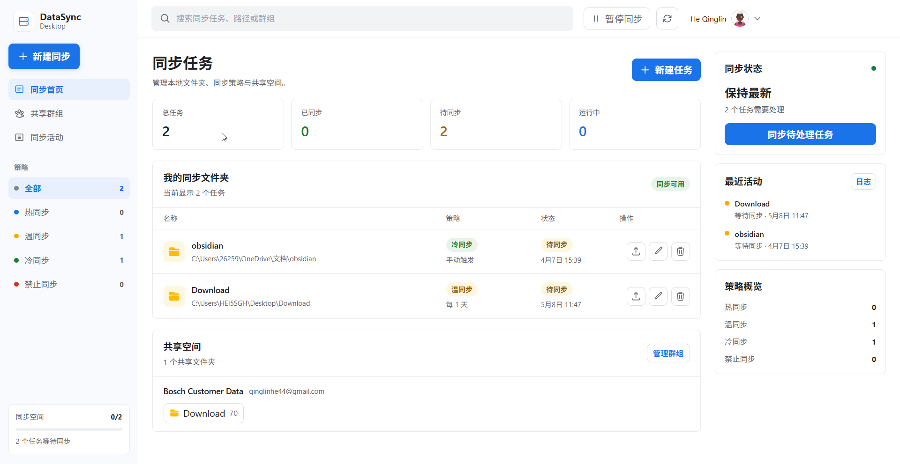 | 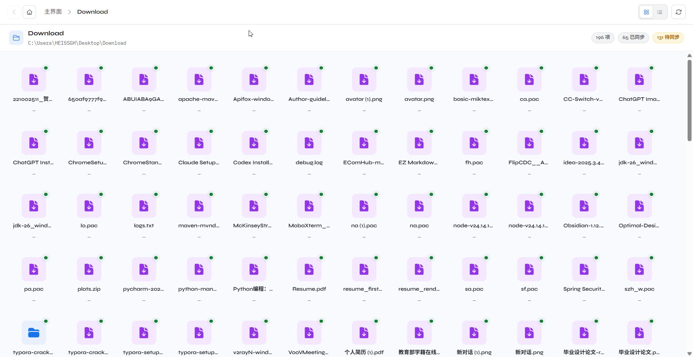 |

| 群组管理                                           | 群组文件浏览                                         |
| -------------------------------------------------- | ---------------------------------------------------- |
| 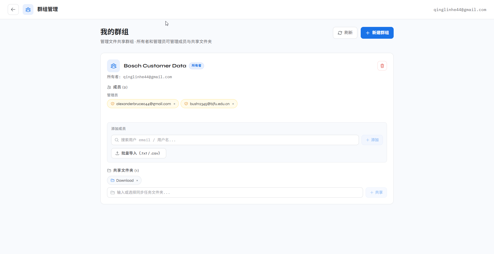 | 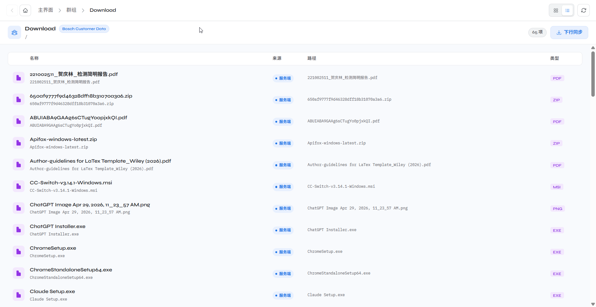 |

| 日志页面                                   | 同步算法选择                                         |
| ------------------------------------------ | ---------------------------------------------------- |
| 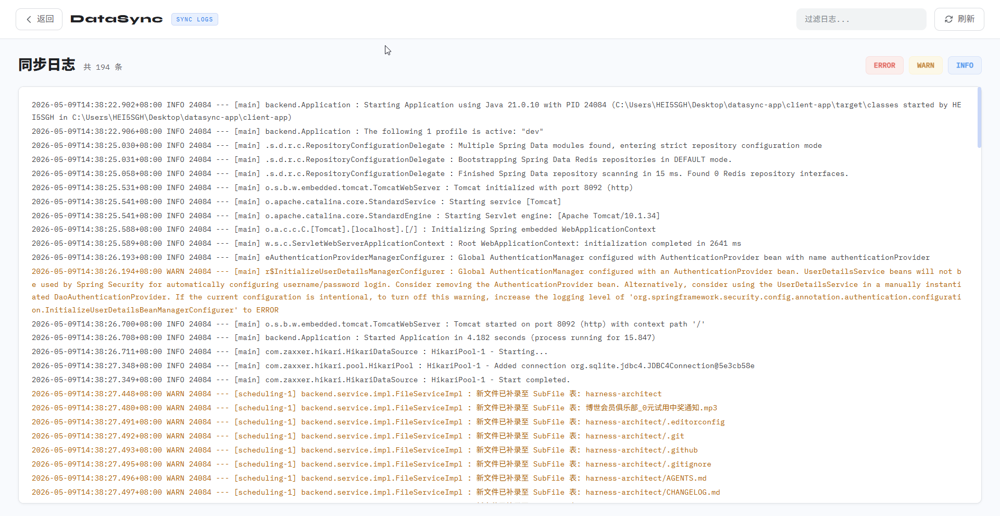 | 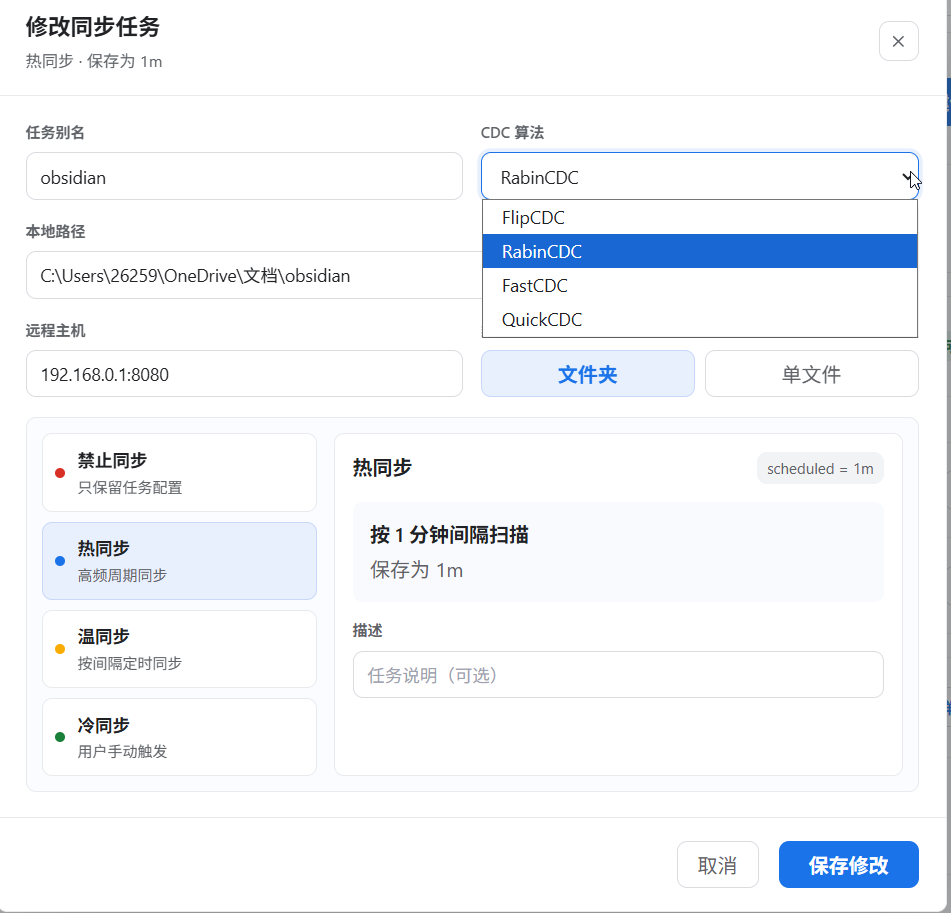 |

<details>
<summary>更多截图</summary>

| 登录                                | 注册                                   |
| ----------------------------------- | -------------------------------------- |
| 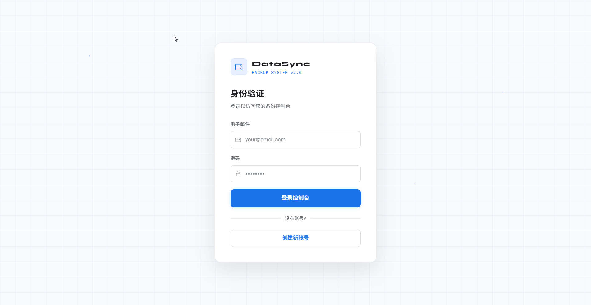 | 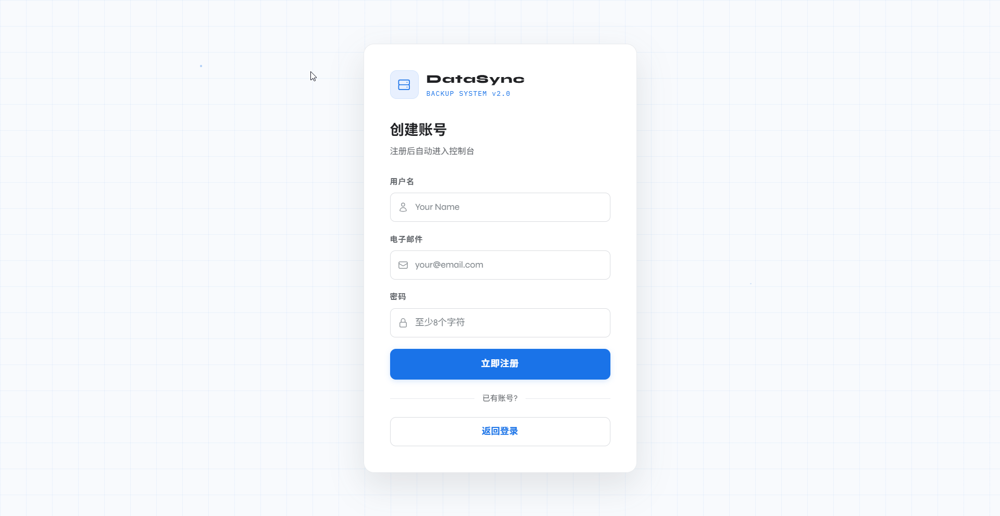 |

| 文件列表视图                                         | 账户设置                                           |
| ---------------------------------------------------- | -------------------------------------------------- |
| 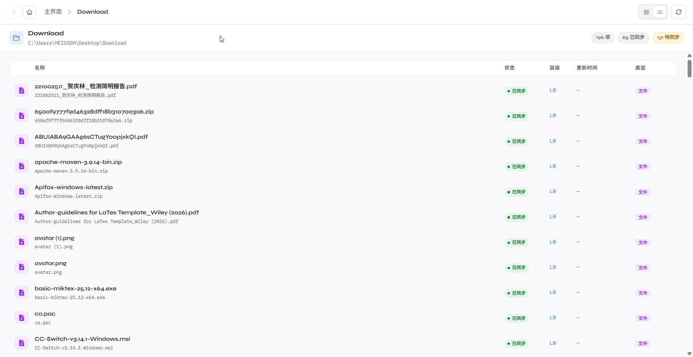 | 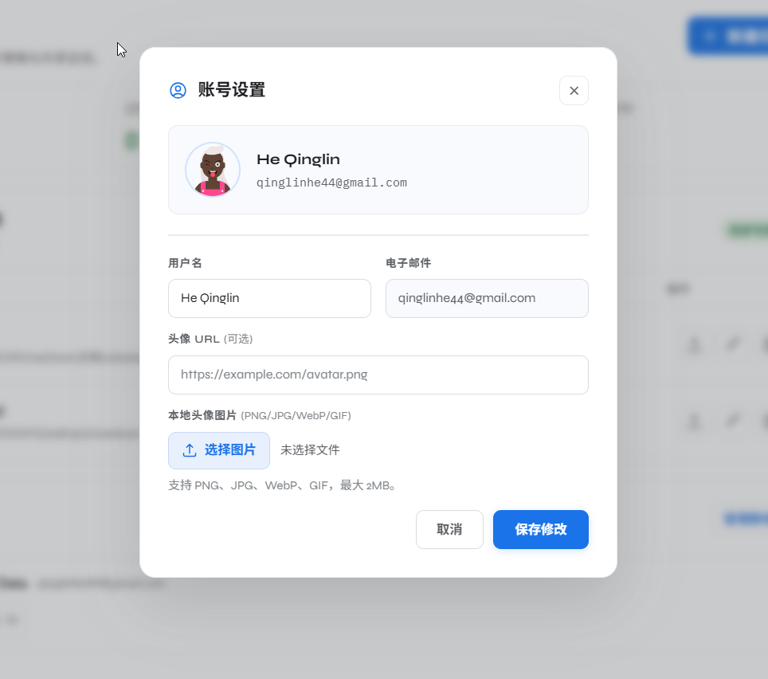 |

</details>

---

## 目录

- [项目定位](#项目定位)
- [仓库结构](#仓库结构)
- [运行架构](#运行架构)
- [功能概览](#功能概览)
- [快速开始](#快速开始)
- [配置说明](#配置说明)
- [桌面端使用流程](#桌面端使用流程)
- [构建与校验](#构建与校验)
- [部署说明](#部署说明)
- [发布流程](#发布流程)
- [文档索引](#文档索引)
- [安全说明](#安全说明)
- [常见问题](#常见问题)
- [贡献指南](#贡献指南)
- [许可证](#许可证)

---

## 项目定位

DataSync 适合需要私有文件同步目标、桌面端操作界面和基础群组共享能力的场景：

- 将本地文件夹或单个文件备份到远端服务器。
- 通过 HTTP(S) 上传文件内容，适配 Hugging Face Spaces 这类只暴露 HTTPS 的部署环境。
- 在重装桌面客户端或本地 SQLite 数据库为空时，从远端恢复已有同步任务。
- 将已上传的任务范围共享给群组，群组成员可以浏览和下载共享文件。
- 用 SQLite 记录本地用户、任务和文件树状态，并在本地文件变化后标记为待同步。
- 用桌面端界面完成常见同步流程，而不是依赖命令行。

DataSync 不是实时协同编辑器，也不做复杂冲突合并。下行同步会覆盖本地同路径文件，请把它视为同步/备份/恢复工具，而不是多人同时编辑同一文件的冲突解决系统。

---

## 仓库结构

```text
datasync/
|-- server/                         中心 Spring Boot 服务端
|   |-- src/main/java/backend/
|   |   |-- controller/              鉴权、文件、群组、用户、健康检查接口
|   |   |-- service/                 服务端文件存储、群组、用户逻辑
|   |   |-- mapper/mysql/            中心用户表 MyBatis Mapper
|   |   |-- sync/server/             旧版 Netty 接收链路
|   |   `-- migration/               旧存储布局迁移支持
|   |-- src/main/java/dataSync/      CDC 算法实现
|   |-- src/main/resources/          Profile、MyBatis XML、SQL 初始化脚本
|   |-- Dockerfile                   Hugging Face Space / Docker 服务端镜像
|   `-- README.md                    服务端部署说明
|
|-- client-app/                      本地 Spring Boot 客户端代理
|   |-- src/main/java/backend/
|   |   |-- controller/              桌面 UI 调用的本地 REST API
|   |   |-- service/                 SQLite、文件扫描、上传/下载编排
|   |   |-- mapper/sqlite/           SQLite Mapper 接口与 XML
|   |   |-- task/                    文件变化监听与定时同步任务
|   |   |-- config/                  远端服务器配置存储
|   |   `-- sync/client/             旧版 Netty 发送链路
|   |-- src/main/java/dataSync/      与服务端一致的 CDC 算法实现
|   `-- src/main/resources/          SQLite 建表脚本与开发配置
|
|-- sync-app/                        Electron + Vue 桌面应用
|   |-- src/main/                    Electron 主进程，负责启动 client-app jar
|   |-- src/preload/                 IPC 桥接
|   |-- src/renderer/src/
|   |   |-- views/                   登录、配置、仪表盘、文件、群组、日志页面
|   |   |-- components/              Vue 组件
|   |   `-- utils/request.js         调用本地 client-app 的 Axios 封装
|   `-- electron-builder.yml         桌面端打包配置
|
|-- docs/screenshots/                README 使用的界面截图
|-- docs/RELEASE.md                  发布检查清单与版本说明
|-- API.en.md / API.md               REST API 文档
|-- Database Tables.en.md / .md      数据库与 JSON 存储文档
|-- ARCHITECTURE.md                  架构、边界、不变量和风险说明
`-- .github/workflows/              CI 与发布工作流
```

---

## 运行架构

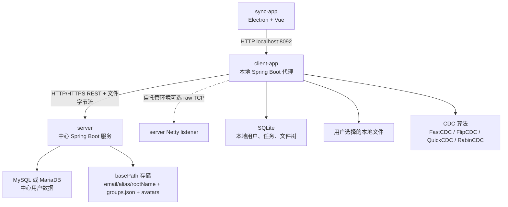

默认端口：

| 组件         |                                    默认端口 | 用途                             |
| ------------ | ------------------------------------------: | -------------------------------- |
| `server`     | 本地 `8090`，Docker Space profile 为 `7860` | 中心 API、文件上传下载、健康检查 |
| `client-app` |                                      `8092` | Electron 渲染进程调用的本地 API  |
| 旧版 Netty   |                                      `8080` | 自托管 raw TCP 同步链路          |

当前桌面端打包链路以 HTTP(S) 上传/下载为主。Netty 相关类仍保留在代码中，用于自托管 raw TCP 场景，但发行版客户端通过 `POST /server/file/upload` 和 `POST /server/file/download/file` 传输文件字节。

远端文件存储 key 使用以下格式：

```text
basePath/<ownerEmail>/<taskAlias>/<rootName>/<relative file path>
```

示例：

```text
/sync/alice@example.com/Work/Documents/report.docx
/sync/alice@example.com/Profile/avatar.png
```

`email/alias/rootName` 这种命名空间可以避免同一用户的多个同名根目录任务互相覆盖，也能避免不同用户同步同名文件夹时发生冲突。

---

## 功能概览

### 桌面客户端

- 首次运行配置远端服务器 URL，以及旧版同步 host/port。
- 登录、注册、本地会话恢复、个人资料和头像编辑。
- 首页展示个人同步任务与群组共享空间。
- 支持创建文件夹任务或单文件任务。
- 同步任务包含别名、描述、本地路径、远端主机、同步间隔、CDC 算法。
- 文件浏览器支持目录导航、列表/网格视图、同步状态、上传、下载、删除、打开本地文件。
- 日志页面读取本地客户端代理日志。

### 文件同步

- 上行同步会扫描本地根路径，并用 FastCDC、FlipCDC、QuickCDC、RabinCDC 之一生成分块信息。
- 服务端 compare 会清理该任务容器内已不存在的远端文件，并返回需要上传的文件。
- 文件字节以 `application/octet-stream` 通过 HTTP(S) 上传。
- 服务端先写 `.part` 临时文件，再替换目标文件。
- 下行同步先获取远端文件列表，再逐个下载原始字节并覆盖本地目标。
- 目录任务和单文件任务都支持。
- 远端任务发现接口可以帮助新装客户端从服务端已有 scope 恢复任务列表。

### 本地状态

- `client-app` 用 SQLite 存储本地用户、同步任务和扫描出的文件树。
- 文件监听任务每 30 秒运行一次，发现本地文件变化后将任务或子文件标记为未同步。
- 定时同步任务每 1 分钟运行一次，到达任务间隔后触发上行同步。
- 定时间隔支持 `5m`、`30m`、`1h`、`6h`、`1d`，也支持纯数字并按分钟解释。空值和 `never` 表示禁用。

### 群组共享

- 服务端将群组元数据存储在 `basePath/groups.json`。
- 角色：
  - Owner：拥有完整控制权，包括删除群组、提升/移除管理员。
  - Admin：可管理普通成员和共享 scope。
  - Member：只读，可查看群组并下载共享 scope。
- 添加成员时使用邮箱，服务端会校验目标用户是否存在于中心用户库。
- 支持通过 `add-members` 和 `remove-members` 接口批量添加/移除成员。
- 共享 scope 与文件同步存储使用同一个 `ownerEmail/alias/rootName` key。
- 如果某个任务仍被群组引用，该任务不能直接删除。

---

## 快速开始

### 前置要求

| 工具             | 版本                      | 用途                               |
| ---------------- | ------------------------- | ---------------------------------- |
| Java JDK         | 21+                       | `server`、`client-app`、发行版构建 |
| Maven            | 3.8+ 或使用仓库内 wrapper | Java 构建与测试                    |
| Node.js          | 推荐 20，通常 18+ 也可用  | `sync-app` 开发                    |
| npm              | 随 Node.js 安装           | 前端依赖                           |
| MySQL 或 MariaDB | 8.0+ 兼容                 | 中心服务端用户数据库               |
| OpenSSL          | 任意较新版本              | 生成 JWT/RSA 密钥                  |

配置文件中保留了 Redis 字段，但当前默认文档化运行链路不需要额外打包 Redis。

### 1. 克隆仓库

```bash
git clone https://github.com/Alexander-Bruce/datasync.git
cd datasync
git config core.hooksPath .githooks
```

### 2. 准备 MySQL

创建数据库：

```sql
CREATE DATABASE datasync CHARACTER SET utf8mb4 COLLATE utf8mb4_unicode_ci;
```

初始化用户表：

```bash
mysql -u root -p datasync < server/src/main/resources/db/mysql-init.sql
```

### 3. 配置并启动服务端

本地开发时编辑 `server/src/main/resources/application-dev.yml`，把 `xxxxxx` 等占位值替换成本机配置。

关键字段：

```yaml
application:
  datasource:
    mysql:
      url: jdbc:mysql://localhost:3306/datasync
      username: root
      password: xxxxxx
  netty:
    server:
      port: 8080
      basePath: /path/to/server/storage
  jwt:
    secretkey: xxxxxx
```

生成 JWT secret：

```bash
openssl rand -base64 32
```

启动服务端：

```bash
cd server
./mvnw spring-boot:run
```

Windows PowerShell：

```powershell
cd server
.\mvnw.cmd spring-boot:run
```

健康检查：

```bash
curl http://localhost:8090/health
```

预期响应：

```json
{ "status": "ok", "service": "datasync-server" }
```

### 4. 配置并启动本地客户端代理

编辑 `client-app/src/main/resources/application-dev.yml`。

本地调试时可保持：

```yaml
application:
  datasource:
    sqlite:
      url: jdbc:sqlite:datasync-user.db?journal_mode=WAL&busy_timeout=5000
  netty:
    client:
      host: localhost
      port: 8080
```

实际 HTTP 服务端 URL 会由桌面端配置页保存到：

```text
~/.datasync/client-config.json
```

启动本地客户端代理：

```bash
cd client-app
./mvnw spring-boot:run
```

Windows PowerShell：

```powershell
cd client-app
.\mvnw.cmd spring-boot:run
```

### 5. 启动桌面端

第三个终端中执行：

```bash
cd sync-app
npm install
npm run dev
```

Electron 窗口打开后，首次运行会进入配置页。远端服务器 URL 填：

```text
http://localhost:8090
```

然后注册或登录。

---

## 配置说明

### 服务端本地 Profile

`server/src/main/resources/application.yml` 设置服务端端口并激活 `dev` profile。本地具体值来自 `server/src/main/resources/application-dev.yml`。

核心配置：

| 配置                                | 含义                                            |
| ----------------------------------- | ----------------------------------------------- |
| `server.port`                       | HTTP API 端口，本地默认 `8090`。                |
| `application.datasource.mysql.*`    | 中心用户库连接信息。                            |
| `application.netty.server.basePath` | 同步文件、`groups.json`、头像文件的根存储目录。 |
| `application.netty.server.port`     | 旧版 Netty 监听端口。                           |
| `application.jwt.secretkey`         | Base64 JWT 签名密钥，真实部署必须替换。         |
| `application.aws.s3.*`              | S3 兼容存储预留字段；默认文件系统存储不依赖它。 |

### 客户端本地 Profile

`client-app` 使用 `client-app/src/main/resources/application-dev.yml` 和运行时配置文件。

| 配置                                     | 含义                                               |
| ---------------------------------------- | -------------------------------------------------- |
| `application.datasource.sqlite.url`      | 本地 SQLite 数据库路径。                           |
| `application.netty.client.host` / `port` | 旧版 Netty fallback 值。                           |
| `application.jwt.secretkey`              | 如果跨模块启用 JWT 校验，应与服务端一致。          |
| `~/.datasync/client-config.json`         | 桌面配置页保存的服务端 URL、sync host、sync port。 |

### 运行时客户端配置示例

```json
{
  "serverBaseUrl": "https://example-datasync-server.com",
  "syncHost": "example-datasync-server.com",
  "syncPort": 8080,
  "configured": true
}
```

Hugging Face Spaces 示例：

```json
{
  "serverBaseUrl": "https://<space-name>.hf.space",
  "syncHost": "<space-name>.hf.space",
  "syncPort": 8080,
  "configured": true
}
```

当前发行版的 HTTP 上传/下载使用 `serverBaseUrl`。`syncHost` 和 `syncPort` 主要保留给旧版 Netty 链路。

---

## 桌面端使用流程

1. 打开桌面应用。
2. 如果进入配置页，填写服务端 URL 并测试连接。
3. 注册用户或登录。
4. 在首页创建同步任务。
5. 选择文件夹或单个文件，填写任务别名，选择 CDC 算法，可选填写同步间隔。
6. 打开任务，浏览本地文件树。
7. 点击上行同步，将本地任务备份到服务端。
8. 点击下行同步，从服务端恢复到本地路径。同路径本地文件可能被覆盖。
9. 需要共享时，在群组页面创建群组。
10. 通过邮箱添加成员，添加共享 scope，成员即可在群组文件浏览器中查看和下载。

CDC 算法选择建议：

| 算法     | 建议场景                                 |
| -------- | ---------------------------------------- |
| FastCDC  | 通用默认选择，适合较大或频繁变化的文件。 |
| QuickCDC | 更偏向扫描速度的场景。                   |
| RabinCDC | 传统 rolling hash CDC 行为。             |
| FlipCDC  | 项目保留的另一种 CDC 实现。              |

---

## 构建与校验

### Java 格式与编译

```bash
cd server
./mvnw spotless:check --no-transfer-progress
./mvnw compile -DskipTests --no-transfer-progress
```

```bash
cd client-app
./mvnw spotless:check --no-transfer-progress
./mvnw compile -DskipTests --no-transfer-progress
./mvnw test -Dtest=SqliteSchemaInitializerTest --no-transfer-progress
```

### 前端格式与 lint

```bash
cd sync-app
npm ci
npx prettier --check "src/**/*.{js,vue,css,html}"
npm run lint
```

### 桌面端打包

Electron 包需要先生成本地客户端代理 jar：

```text
client-app/target/dataSync-server-0.0.1-SNAPSHOT.jar
```

先构建 jar：

```bash
cd client-app
./mvnw -DskipTests package --no-transfer-progress
```

再打包桌面端：

```bash
cd sync-app
npm run build:win
npm run build:linux
npm run build:mac
```

CI 会通过 `.github/workflows/release.yml` 构建 Windows 与 Linux 发行资产。

---

## 部署说明

### 本地服务端

自托管本机服务时直接使用本地 profile：

```bash
cd server
./mvnw spring-boot:run
```

不要把真实密码、JWT secret、私钥提交到 Git。由于开发配置文件是仓库内文件，提交前一定要检查 `git diff`。

### Docker / Hugging Face Space

`server/` 目录可作为 Docker SDK Hugging Face Space 运行。容器会运行：

- Spring Boot 服务端，端口 `7860`。
- 容器内 MariaDB。
- `/sync` 下的同步文件存储。
- 启用 Space persistent storage 时，将 `/sync` 链接到 `/data/sync`。

真实部署建议设置以下 secrets：

| Secret             | 用途                       |
| ------------------ | -------------------------- |
| `MYSQL_PASSWORD`   | 容器内 MariaDB root 密码。 |
| `JWT_SECRETKEY`    | JWT 签名密钥。             |
| `AWS_S3_ACCESSKEY` | 可选 S3 兼容访问密钥占位。 |
| `AWS_S3_SECRETKEY` | 可选 S3 兼容私钥占位。     |

常用可选变量：

| 变量                | 默认值                                 |
| ------------------- | -------------------------------------- |
| `MYSQL_URL`         | `jdbc:mysql://127.0.0.1:3306/datasync` |
| `MYSQL_USERNAME`    | `root`                                 |
| `NETTY_BASE_PATH`   | `/sync`                                |
| `NETTY_SERVER_PORT` | `8080`                                 |
| `PUBLIC_BASE_URL`   | 空，能从请求推断时自动推断             |

更多部署细节见 [server/README.md](server/README.md)。

---

## 发布流程

当前公开正式版：**DataSync v1.0.7**。

推送 `v*` tag 或手动触发 `.github/workflows/release.yml` 会构建并发布 GitHub Release。

典型发布流程：

```bash
git checkout main
git pull --ff-only
git tag v1.0.8
git push origin v1.0.8
```

发布工作流会构建：

- Windows 安装器：`sync-app-<version>-setup.exe`
- Windows blockmap：`sync-app-<version>-setup.exe.blockmap`
- Linux AppImage：`sync-app-<version>.AppImage`
- Linux Debian 包：`sync-app_<version>_amd64.deb`
- Electron 更新元数据：`latest.yml`、`latest-linux.yml`

详细发布检查清单见 [docs/RELEASE.md](docs/RELEASE.md)。

---

## 文档索引

| 文档                                             | 用途                                             |
| ------------------------------------------------ | ------------------------------------------------ |
| [README.md](README.md)                           | 英文项目概览与操作说明。                         |
| [ARCHITECTURE.md](ARCHITECTURE.md)               | 模块边界、运行流程、存储布局、不变量和风险说明。 |
| [API.en.md](API.en.md)                           | 英文 REST API 文档。                             |
| [API.md](API.md)                                 | 中文 REST API 文档。                             |
| [Database Tables.en.md](Database%20Tables.en.md) | 英文数据库与 JSON 存储文档。                     |
| [Database Tables.md](Database%20Tables.md)       | 中文数据库与 JSON 存储文档。                     |
| [server/README.md](server/README.md)             | 服务端 Docker 与 Hugging Face Space 部署说明。   |
| [docs/RELEASE.md](docs/RELEASE.md)               | 发布检查清单、产物命名和回滚说明。               |

---

## 安全说明

- 中心服务端使用 BCrypt strength 12 存储密码。
- JWT 由服务端生成，本地客户端缓存 token。
- 当前 Spring Security 配置允许 `/client/**` 与 `/server/**` 路由访问，但如果请求带有 Bearer token，JWT filter 会校验 token。除非收紧访问控制，否则应把它视为桌面/私有部署模型。
- 头像上传支持指定图片类型的 base64 data URL，并限制 2 MB 以内。
- 服务端会规范化文件路径，并校验目标路径必须位于配置的存储根目录下。
- 上传文件会拒绝不安全文件名，并通过 `.part` 临时文件写入。
- 不要提交真实数据库密码、JWT secret、私钥、本地 SQLite 数据库、日志或发行包。

---

## 常见问题

### 桌面端一直停在配置页

确认本地客户端代理运行在 `127.0.0.1:8092`。开发模式下需要先启动 `client-app` 再启动 `sync-app`。发行版中 Electron 会自动启动客户端代理 jar。

### 配置页无法连上服务端

检查服务端健康接口：

```bash
curl http://localhost:8090/health
```

如果服务端部署在 Hugging Face Spaces，应填写 HTTPS Space URL，而不是 raw Netty host。

### 重装客户端后登录状态异常

本地 SQLite 缓存可能为空，但 Electron localStorage 仍有旧数据。清空应用存储或重新登录。`/client/user/session/current` 与 `/server/user/resolve` 用于在缓存足够时恢复会话。

### Space 重启后上传文件消失

需要启用 Hugging Face persistent storage。未启用时 `/sync` 是临时目录；启用后入口脚本会把 `/sync` 链接到 `/data/sync`。

### 同步任务无法删除

该任务 scope 仍被某个群组引用。先从群组中移除共享 scope 或删除群组，再删除任务。

### 下行同步覆盖了本地文件

这是当前设计。DataSync 的下行同步会把远端 scope 恢复到选定本地目标，同路径文件会被覆盖。

---

## 贡献指南

1. Fork 仓库。
2. 克隆后启用 hook：`git config core.hooksPath .githooks`。
3. Java 代码使用 Spotless 格式化，前端代码使用 Prettier。
4. 推送前运行相关校验。
5. 不要提交本地凭据或生成的运行时文件。
6. 向 `main` 分支发起 Pull Request。

---

## 许可证

DataSync 使用 [MIT License](LICENSE) 开源。
